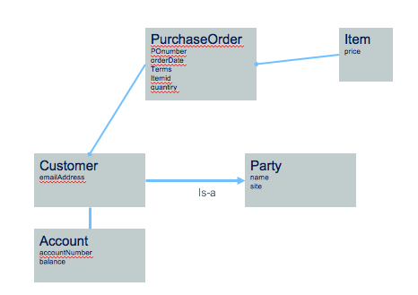

# Set of RESTful services to manage customer and purchase order
This project is part of the 'IBM Data Analytics Reference Architecture' solution, available at [https://github.com/ibm-cloud-architecture/refarch-analytics](https://github.com/ibm-cloud-architecture/refarch-analytics). 

Updated 11/27/2017.

The goal of this project is to implement a set of RESTful services to manage customer and purchase order. 

## Table of Contents
* [Code explanation](#code-explanation)
* [Build and deploy](#build-and-deploy)
* [Install on ICP](docs/icp/README.md)
* [TDD](#test-driven-development)

## Code Explanation

The data model to support is presented in the figure below:

## Build and Deploy

## Test Driven Development

