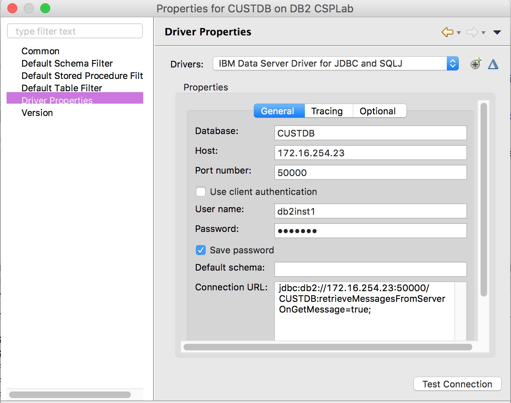
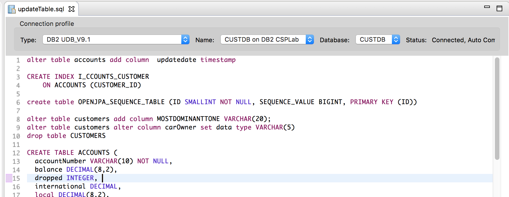

# Customer Database in DB2
This quick note to summarize what is done on the DB2 side.

## Server Configuration
We are using the DB2 setting as presented in [this note](https://github.com/ibm-cloud-architecture/refarch-integration-inventory-db2#db2-server-installation)

## Scripts
The `db-scripts` folder includes the DDL to create the tables, and the shell scripts `createDB.sh` should help to create the database instance and tables.

## Working from Eclipse during development
Using the Eclipse `Database Development Perspective` we can access to the database and alter the schema or data. The data base connection is as below:


```
Database: CUSTDB
Host: server IP address
Port: 50000
```

If you want to execute SQL commands you can use the updateTable.sql scrapbook in Eclipse to execute them. The figure below illustrates the parameters to be set up and example of commands:



It is a very nice feature to fine tune the model and database, load sample data, or verify data loaded from other scripts.


## Loading Data
The
