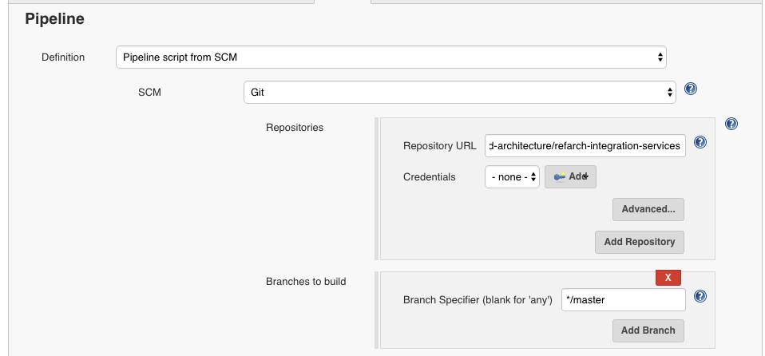

# CI/CD for Customer microservice

## Pre-requisites
You need to have a jenkins server configured. We propose two approaches as explained in [this note](https://github.com/ibm-cloud-architecture/refarch-integration/tree/master/docs/devops#installation).

## jenkinsfile
This project is using the same approach as [this project](https://github.com/ibm-cloud-architecture/refarch-integration-inventory-dal/tree/master/docs/devops#jenkinsfile-explained) to use docker staging to build the image and docker plugin and template for jenkins.

## Pipeline Setup
Follow the same procedure as described [here](https://github.com/ibm-cloud-architecture/refarch-integration/tree/master/docs/devops#creating-pipeline) with the following arguments:
+ **Repository URL:** `https://github.com/ibm-cloud-architecture/refarch-integration-services.git`
+ **Branch:** `master`
+ **Script Path:** `Jenkinsfile`

